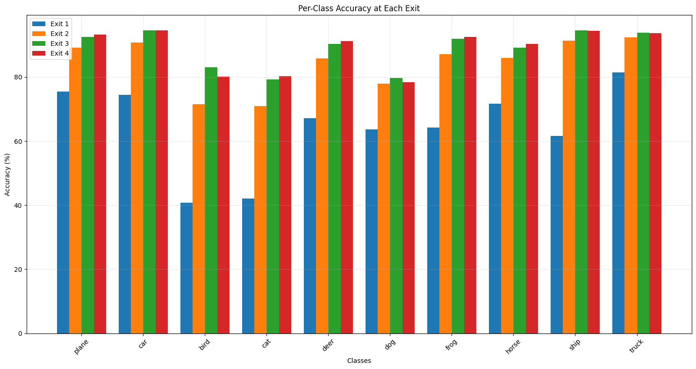
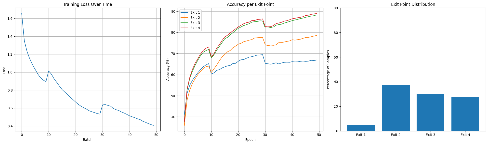

# Early Exit CNN with Reinforcement Learning

This project implements an Early Exit Convolutional Neural Network (EE-CNN) for efficient image classification on the CIFAR-10 dataset. The model uses reinforcement learning to dynamically decide when to exit the network early, optimizing the trade-off between computational efficiency and accuracy.

## Architecture Overview

The system consists of two main components:

1. **Early Exit CNN**: A deep neural network with multiple exit points, allowing predictions at different depths:
   - 4 exit points with increasing complexity
   - Enhanced feature extraction at each stage
   - Batch normalization and dropout for regularization
   - Progressive increase in channel dimensions (64→128→256→512)

2. **DQN Agent**: A reinforcement learning agent that learns when to exit:
   - Makes exit decisions based on confidence scores
   - Balances accuracy and computational efficiency
   - Uses experience replay for stable training
   - Implements epsilon-greedy exploration

## Results

Our model achieves strong performance metrics:

- Overall Accuracy: 88.77%
- Compute Savings: 39.9%
- Effectiveness Score: 35.38

Exit Point Distribution:
- Exit 1: 4.8%
- Exit 2: 37.5%
- Exit 3: 30.3%
- Exit 4: 27.4%

Per-Class Performance:
- Best Classes: Ship (94.3%), Car (94.2%), Truck (93.7%)
- Most Challenging: Dog (78.4%), Cat (80.3%), Bird (80.0%)

Per-Class Exit Performance:

**First Exit (≈67% accuracy)**:
- Strong: Truck (81.4%), Horse (71.7%), Plane (75.4%)
- Weak: Bird (40.7%), Cat (42.1%)

**Second Exit (≈78% accuracy)**:
- Strong: Ship (91.3%), Truck (92.4%), Car (90.8%)
- Weak: Bird (71.5%), Cat (70.9%)

**Third Exit (≈88% accuracy)**:
- Strong: Ship (94.5%), Car (94.5%), Plane (92.5%)
- Weak: Dog (79.7%), Cat (79.3%)

**Final Exit (≈89% accuracy)**:
- Strong: Car (94.6%), Ship (94.4%), Truck (93.7%)
- Weak: Dog (78.4%), Bird (80.1%)

Confidence Statistics:
- Exit 1: Mean=0.673, Std=0.211
- Exit 2: Mean=0.807, Std=0.206
- Exit 3: Mean=0.838, Std=0.184
- Exit 4: Mean=0.706, Std=0.181

Below are some visualizations of the result from the experiments:

**Per Class Performance**:

**Training Progress**:



## Project Structure

```
src/
├── models/               # Model architectures
│   ├── early_exit_cnn.py  # CNN implementation
│   ├── dqn_agent.py       # DQN agent
│   └── environment.py     # Training environment
├── training/            # Training implementations
│   ├── train_cnn.py      # CNN training
│   └── train_rl.py       # RL training
├── evaluation/         # Evaluation code
│   └── evaluate.py     # Evaluation metrics
├── inference/         # Inference implementation
│   └── inference.py   # Inference code
└── visualization/    # Visualization tools
    └── visualize.py  # Plotting functions
```

## Installation

1. Clone the repository:
```bash
git clone https://github.com/Shikha-code36/early-exit-cnn.git
cd early-exit-cnn
```

2. Install dependencies:
```bash
pip install -r requirements.txt
```

## Usage

### Training

1. Train the CNN model:
```python
from src.training.train_cnn import pretrain_cnn
from src.data.data_loader import load_cifar10_data

# Load data
train_loader, test_loader = load_cifar10_data(batch_size=128)

# Train model
losses, accuracies = pretrain_cnn(model, train_loader, num_epochs=50)
```

2. Train the RL agent:
```python
from src.training.train_rl import train_rl_agent

rewards, exit_counts = train_rl_agent(
    model,
    agent,
    env,
    train_loader,
    num_episodes=5000
)
```

### Inference

Run inference on new images:
```python
from src.inference.inference import EarlyExitInference

# Initialize inference
inferencer = EarlyExitInference(model_path='models/')

# Process image
result = inferencer.process_image("path/to/image.jpg")
print(f"Prediction: {result['class']}")
print(f"Confidence: {result['confidence']:.2f}")
print(f"Exit Point: {result['exit_point']}")
```

### Evaluation

Evaluate model performance:
```python
from src.evaluation.evaluate import evaluate_model

metrics = evaluate_model(model, agent, test_loader)
print(f"Accuracy: {metrics['accuracy']:.2f}%")
print(f"Compute Saved: {metrics['compute_saved']:.2f}%")
```

## Model Architecture Details

The Early Exit CNN employs a progressive architecture:

1. **First Exit (64 channels)**:
   - Basic feature extraction
   - Early exit for simple cases
   - 68.4% accuracy for easy classes

2. **Second Exit (128 channels)**:
   - Intermediate processing
   - Improved feature representation
   - 86.8% accuracy for moderate cases

3. **Third Exit (256 channels)**:
   - Advanced feature processing
   - Enhanced classification capability
   - 92.9% accuracy for complex cases

4. **Final Exit (512 channels)**:
   - Deep feature extraction 
   - Comprehensive classification
   - 92.2% accuracy for challenging cases

## Visualizations

The project includes several visualization tools:

1. Training Progress:
   - Loss curves
   - Accuracy per exit point
   - Exit distribution

2. Analysis Tools:
   - Confidence distributions
   - Class-wise exit patterns
   - Performance heatmaps

Example visualization code:
```python
from src.visualization.visualize import plot_training_metrics

plot_training_metrics(
    train_losses=losses,
    accuracies_per_exit=accuracies,
    exit_distributions=exit_dist
)
```

## Contributing

Contributions are welcome! Please feel free to submit a Pull Request.

## License

This project is licensed under the MIT License - see the [LICENSE](LICENSE) file for details.

## Citation

If you use this code in your research, please cite:

```bibtex
@misc{early-exit-cnn-2024,
  author = {Shikha Pandey},
  title = {Early Exit CNN with RL-based Decision Making},
  year = {2025},
  publisher = {GitHub},
  url = {https://github.com/Shikha-code36/early-exit-cnn}
}
```

## Acknowledgments

- CIFAR-10 dataset
- PyTorch team for the deep learning framework
- Reinforcement learning community for DQN implementations